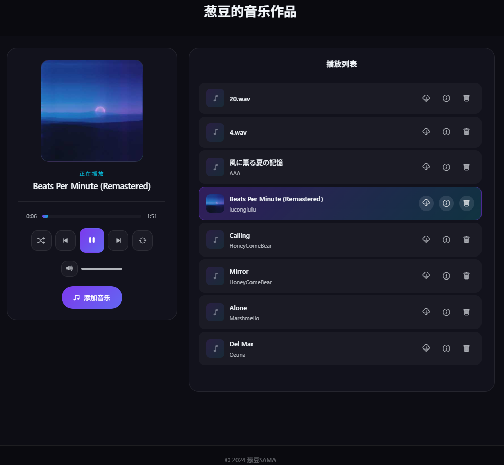

# miyu-music

一个美观、轻量级的网页音乐播放器，支持拖拽排序、文件上传和管理。

## 📸 界面预览




## ✨ 功能特性

-   **优雅的界面**：采用深色玻璃拟态设计（Glassmorphism），视觉体验极佳。
-   **核心播放功能**：支持播放/暂停、上一曲/下一曲、随机播放、列表循环/单曲循环。
-   **拖拽排序**：支持直接拖动播放列表中的歌曲进行排序，且排序状态会自动保存到服务器。
-   **音乐下载**：支持直接下载播放列表中的音乐文件。
-   **音乐管理**：
    -   支持上传音乐文件（MP3, WAV, OGG, M4A）。
    -   支持删除音乐文件。
    -   **安全保护**：上传和删除操作受密码保护。
-   **元数据解析**：自动解析音频文件的封面、标题、艺术家等信息。

## 🚀 部署与启动

### 1. 安装依赖

确保你已经安装了 [Node.js](https://nodejs.org/)。

```bash
npm install
```

### 2. 使用 PM2 启动 (推荐)

为了保证服务稳定运行并支持开机自启，建议使用 PM2 进行部署。

**安装 PM2:**
```bash
npm install -g pm2
```

**启动服务:**
```bash
pm2 start server.js --name miyu-music
```

**设置开机自启:**
```bash
pm2 save
pm2 startup
```
*(运行 `pm2 startup` 后，请根据终端提示执行相应的命令来锁定自启配置)*

## ⚙️ 配置说明

### 修改管理员密码 (重要！)

默认的系统密码用于保护上传和删除音乐的操作。**为了安全起见，请务必修改默认密码。**

1.  打开 `server.js` 文件。
2.  找到以下代码行（约第 10 行）：

```javascript
const SYSTEM_PASSWORD = 'miyu2024'; 
```

3.  将 `'miyu2024'` 修改为你想要的密码。

3.  将 `'miyu2024'` 修改为你想要的密码。

### 修改服务端口

默认端口为 `3337`。如果需要修改：

1.  打开 `server.js` 文件。
2.  找到以下代码行（约第 8 行）：

```javascript
const PORT = process.env.PORT || 3337;
```

3.  将 `3337` 修改为你想要的端口号。

### 音乐文件存储

-   所有上传的音乐文件存储在 `music/` 目录下。
-   播放列表的顺序信息存储在 `music/playlist.json` 中。

## 📂 项目结构

-   `server.js`: 后端服务器入口，处理 API 请求和文件管理。
-   `index.html`: 前端主页面。
-   `js/`: 前端脚本文件。
    -   `app.js`: 主要业务逻辑，包括播放列表渲染、交互处理。
    -   `custom-player.js`: 播放器控制条的逻辑。
-   `css/`: 样式文件。
-   `music/`: 存放音乐文件和播放列表数据。

---
&copy; 2024 葱豆SAMA
